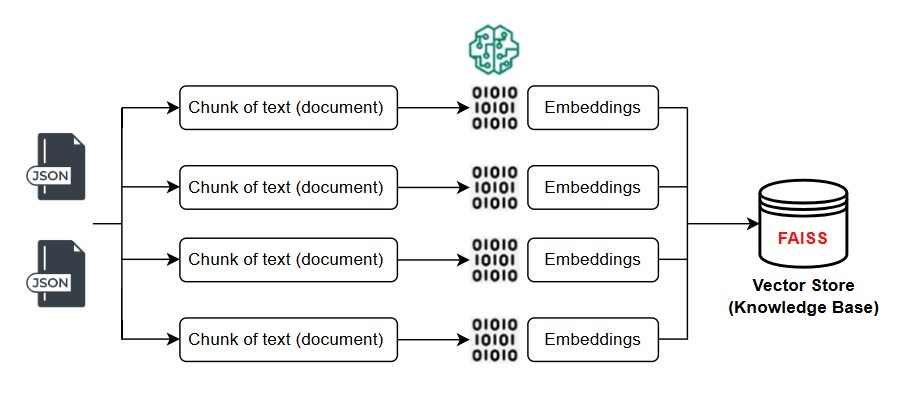
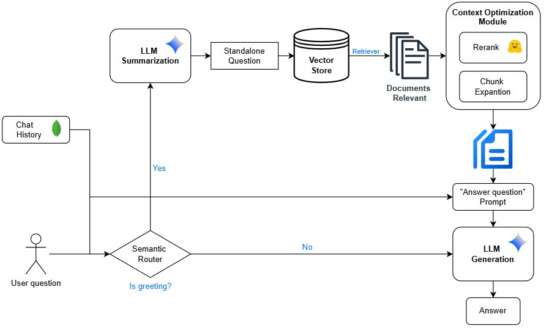

# Nghiên cứu và xây dựng Chatbot ứng dụng trí tuệ nhân tạo hỗ trợ hoạt động tại phòng đào tạo Trường Đại học Công nghiệp Hà Nội
Trong thời đại chuyển đổi số, trí tuệ nhân tạo (AI) đang dần trở thành công nghệ cốt lõi trong việc nâng cao hiệu quả quản lý và cung cấp dịch vụ trong nhiều lĩnh vực, đặc biệt là giáo dục. Tại các cơ sở đào tạo, nhu cầu tự động hóa quá trình tiếp nhận và phản hồi thông tin từ sinh viên ngày càng tăng, nhằm giảm tải cho đội ngũ cán bộ và nâng cao trải nghiệm người học. Trước thực tế đó, việc nghiên cứu và phát triển một hệ thống ChatBot thông minh được xem là một hướng đi tiềm năng. Giải pháp này không chỉ đảm bảo khả năng phản hồi chính xác và tức thời mà còn dễ dàng mở rộng, cập nhật tri thức liên tục từ các nguồn dữ liệu chính thống của nhà trường. Trong nghiên cứu này tôi tích hợp Retrieval-Augmented Generation (RAG) và thu thập dữ liệu web tự động để tạo ra một tác nhân hội thoại thông minh, thời gian thực. AutoCrawl thu thập và cập nhật kiến thức một cách tự động, sau đó nhúng nó vào cơ sở dữ liệu vector, trong khi RAG truy xuất và tổng hợp phản hồi bằng cách sử dụng mô hình ngôn ngữ lớn (LLM). Kiến trúc này giải quyết những hạn chế của các chatbot truyền thống bằng cách cung cấp chính xác ngữ cảnh phù hợp và câu trả lời mới nhất. Giải pháp này mang đến một phương pháp có thể mở rộng cho hỏi đáp thời gian thực, kết hợp thu thập dữ liệu động với AI dựa trên truy xuất tiên tiến.

## Tạo cơ sở dữ liệu tri thức (Vectorstore)

## Luồng xử lý truy xuất tài liệu và sinh câu trả lời

## Demo sản phẩm
